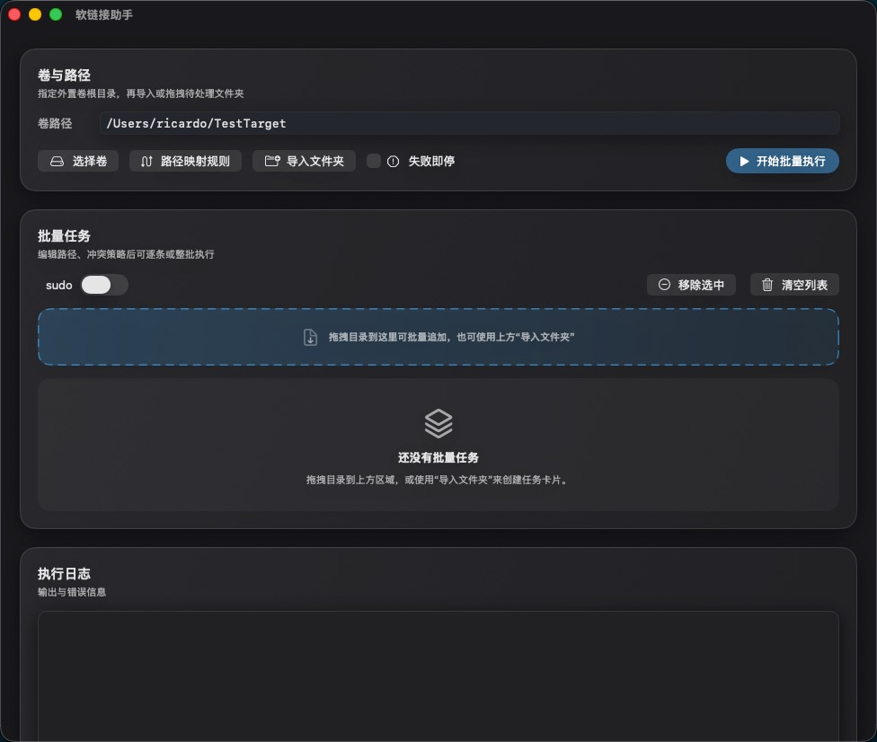

# LnToExternalDisk

LnToExternalDisk 是一个 macOS 工具，用来将本地文件夹迁移到外置硬盘，并在原位置创建符号链接（symlink）。

这样你可以在不改变原有路径习惯的前提下，把占空间的目录转移到外部存储设备，释放本机磁盘空间，同时尽量保持原有软件或工作流继续按原路径访问这些内容。

## 界面预览

它适合用于这类场景：

- 某些目录体积很大，但你又不想改它们原来的路径
- 你希望把数据迁移到外置磁盘，同时保留原位置的访问入口
- 你需要批量处理多个文件夹，而不是手动一个个移动和创建软链接
- 你想对目标路径做统一映射，并控制目标已存在时的处理方式

LnToExternalDisk 的核心目标是：
**把“目录迁移到外置存储 + 原地保留可访问入口”这件事做得更直观、更省事。**
